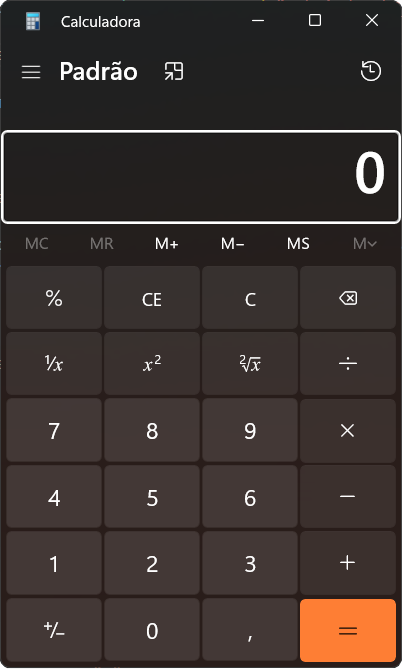

# Calculator Buddy 🧮

Have you ever wished you could use the windows calculator app without actually interacting with the app yourself?

### GOOD NEWS!! Now you can 🥳

**Calculator Buddy** will lauch the calculator, ask you for the inputs you would input yourself (like a filthy peasant) and do all the hard work for you! And no, you not dreaming, *it's really that good*.

## Important caveats

1) Calculator buddy is really picky about the calculator app itself, so I recommend trying to use a setup as close to mine as possible: Windows 11, 1920x1080, dark mode and with the smallest calculator window allowed. Here's an image of my calculator:
    

2) If it is really not working for you, you might have to change the button images to ones that match you calculator app better. Avoid the corner of the buttons, because those are dependent on the window size.

## Disclaimer

No, I don't think this an actually useful project. This only exists as a fun stepping stone to more useful automation projects using pyautogui.
